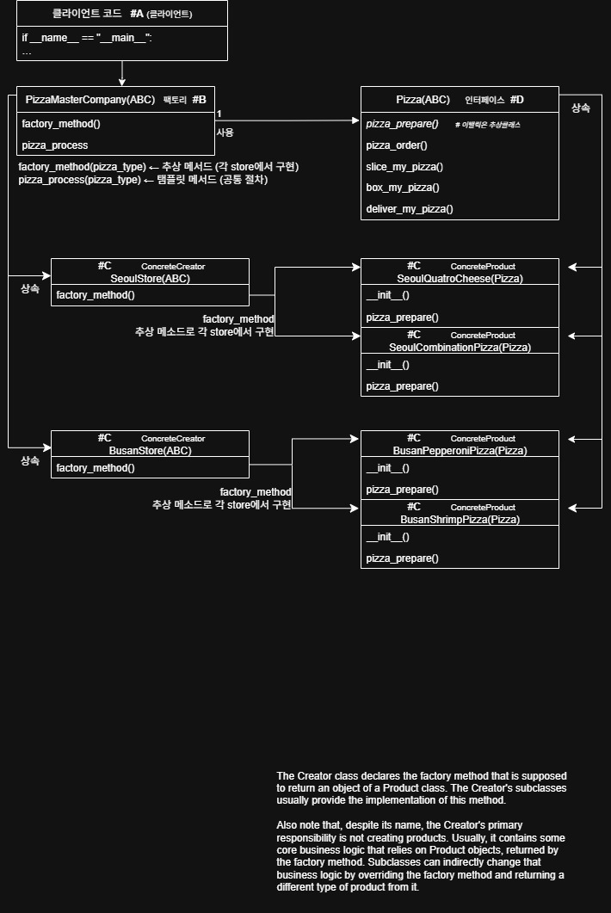
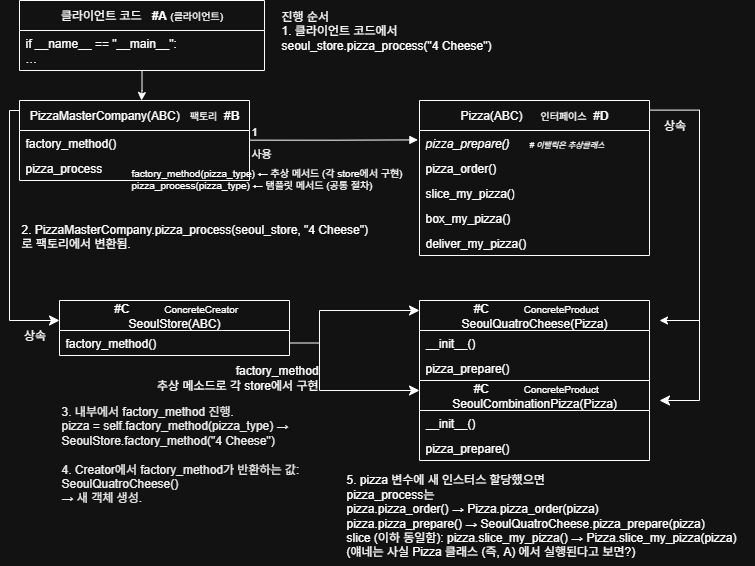

<h1>20250924</h1>
<h3>팩토리 메서드</h3><br>

Keyword:
<details><summary>팩토리 패턴</summary>객체 생성을 하는 역할을 별도 공장Factory로 분리/캡슐화 하는 것. 그럼으로 클라이언트는 어떤 구체 클래스를 만들지 몰라도 되게.</details>
<details><summary>팩토리 메서드</summary>생성 자체를 서브클래스가 결정하도록 연결해 주는 메서드. 팩토리는 알고리즘 틀을, 그 하위의 Creator가 제품(프로덕트)를 뭘 만들지 선택하는 방식.</details>
self 설명
<br>현재 메서드를 호출한 그 인스턴스 자기 자신을 가리키는 참조.
<br>예시로 설명하자면

```python
seoul_store = SeoulStore() #인스턴스 생성
# 메서드 호출
seoul_store.pizza_process("4 Cheese")
# 이 때! Python이 자동으로 변환을 해 주는데.
'''
seoul_store.pizza_process("4 Cheese")
    ↓
PizzaMasterCompany.pizza_process(seoul_store, "4 Cheese")
seoul_store가 저기 들어오게 됩니다.
'''
# pizza_process 내부는
def pizza_process(self, pizza_type: str):
    # 여기서 self == seoul_store (메모리 주소 0x1a2b3c)
    print(self)  # <__main__.SeoulStore object at 0x1a2b3c>
'''    
    # factory_method 호출
    pizza = self.factory_method(pizza_type)
            ^^^^
            self는 seoul_store이므로
            SeoulStore.factory_method()가 호출됨!
'''
# 동적으로 올바른 하위 클래스의 메서드를 찾아갑니다.
```
super()?
- 부모 클래스의 메서드를 호출합니다. `__init__` 에서 Parents class의 초기화 로직을 재사용할 때 사용됩니다.
- `SeoulQuatroCheese.__init__(self)` 호출 → `super().__init__` → `Pizza.__init__(self, ~~)` → `self.name = "~~"` 으로 name 속성 생성
- `pizza.name = "~~"` 접근이 가능하다.

<details><summary></summary></details>

ABCD 순으로 나타내자면...
- A: 클라이언트. 파일에서는 구동부/실행하기 위해 입력값을 넣는 부분에 해당.
- B: 팩토리. 알고리즘의 틀 부분. 클래스로 지정했음. 사실상 이것부터 먼저 짜야 함. 탬플릿 메서드가 들어갑니다.
- C: 실제 구체 제품 인스턴스가 만들어지는 부분. Creator와 Product로 나누기도 함.
    - Creator: 0924/main.py 에선 서울매장/부산매장 으로 나눈 요소. 
    - Product: 0924/main.py 에선 
- D: 인터페이스. A가 의존하는 공통 인터페이스. A가 타입을 모르더라도 일관된 메서드로 다룰 수 있게.

어떻게 호출 흐름이 발생하는가?
1. 클라이언트에서 발생:
- `seoul_store = SeoulStore()` 로 `ConcreteCreator` 지정
- 진짜실행: `seoul_store.pizza_process("4 Cheese")`
- `ConcreteCreator` 안에 있는 pizza_process로 작업 시작해요.
- `"4 Cheese"`는 `str` 이죠? B인 팩토리에 보면 `pizza_process` 는 `pizza_type` 을 str로 받아요 그리고 그게 저 4 cheese인 거고

2. 팩토리로 이동
- `class PizzaMasterCompany(ABC)` 로 왔습니다. 왜? 여기에 있는 `pizza_process`로 가야 하기 때문이죠.
- 여기에 있는 `self.factory_method` 보이죠? `pizza_type`을 받아온 게 보이죠? 우리는 이게 4 cheese이고, 다른 경우는 다른 피자의 태그에 해당하겠죠.
- `pizza = self.factory_method(pizza_type)` 으로 동적 바인딩이 발생.
- 동적 바인딩이 뭐죠? `self` 의 역할은 뭐죠?
- factory_method를 호출했는데, 호출을 한 게 pizza고 self는 pizza(즉 자기 자신)를 가리켜용.
- 그 다음은 factory_method가 요구하는 pizza_type을 넣어줍니다.

3. Creator로 이동
구체적으로 이루어지는건 여기, ConcreteCreator.
여기서 팩토리메서드를 받는데, 보다시피 그냥 단순해요. if문으로 이게 그거니? 묻는 정도.
우리는 4cheese를 pizza_type으로 받았으니 SeoulQuatroCheese() 라는 프로덕트로 반환. 자 그럼 밑에 있는걸로 이동!

4. Product로 이동
SeoulQuatroCheese로 왔습니다.
여긴 두 개의 메서드가 있죠? __init__이랑 pizza_prepare.
__init__은 별 거 없어요. (내용)
그 다음, pizza_prepare가 여기 있는 이유? 각 피자마자 준비를 다르게 해야 하기 때문에 구현해 뒀습니다.
여기서야 간단하게 적혀 있지만, 실제로는 좀 더 다르겠죠. 피자를 준비하는데 다른 재료가 들어가고 뭐 그렇게. 도우 세팅도 다를거고.
일단 이 함수들이 여기 있다는 걸 기억한 채, 다시 위로 돌아갑니다. 어디로? PizzaMasterCompany로!

5. PizzaMasterCompany(ABC) 복귀
여기서부터 이제 처리해야죠. pizza_order, pizza_prepare, slice_my_pizza, box_my_pizza, deliver_my_pizza 순서로.
pizza_order는 A. 인터페이스에서 받아온걸로 진합니다. 피자 주문을 받았고
pizza_prepare는 B-> C(Creator) - C(Product)에서 최종적으로 가져온 것을 출력합니다.
(정확히는, C(product) - 끌올 c(Creator) - 끌올 B(팩토리 메서드) 겠지만?)
그다음은 뭐, slice_my_pizza, box~ deliver~은 인터페이스에 디파인 된 거 그대로 갖고오면 되겠죠.

1) `pizza.pizza_order()` 실행!: `4 Cheese 피자 주문을 받습니다`
2) `pizza.pizza_prepare()` 실행: `4 Cheese Pizza going`
3) `pizza.slice_my_pizza()` 실행: `4 Cheese 피자를 자릅니다.`
4) `pizza.box_my_pizza()` 실행: `4 cheese 피자를 박스에 담습니다.`
5) `pizza.deliver_my_pizza()` 실행: `4 cheese 피자를 배송 중.`
6) 종료 메세지 출력




<details><summary>나의 생각</summary>팩토리메서드 잘 쓰면 아주아주 좋을 것 같단 생각?<br>이것과 전략패턴이 흡사해 보인다는 생각<br>이해한것 같으면서 이해하지 못한 것 같네요.</details>
